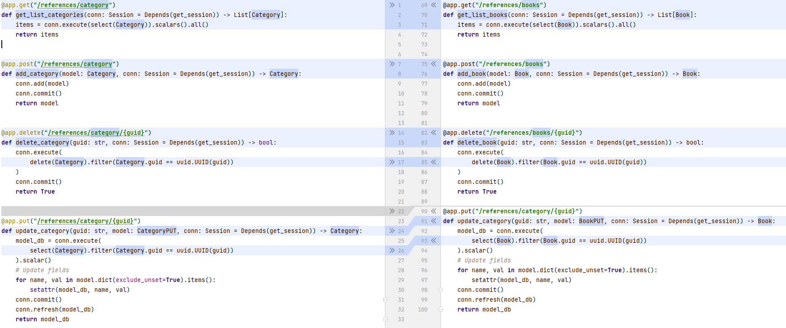

# First Steps

## Install `SQLModel`

First you need to install sqlmodel and dependencies:

```sh
pip install sqlmodel psycopg2 alembic
```

## A basic CRUD app

Consider a basic create-read-update-delete (CRUD) app where can create "Book" & "Category" instances.

```python hl_lines="31 32 37 38 44 45 53 54 70 71 76 77 83 84 92 93"
{!./src/first_steps/create_base_app.py!}
```

If you look at the highlighted lines above, you can see that construction:

`conn: Session = Depends(get_session)`

has been repeated 8 times and there are a lot of duplicates in the code.



The OpenAPI specification looks like this:


## Class based API

By using the `Routable` class, we can consolidate the endpoint signatures and reduce the number of repeated
dependencies.

To use the `Routable` class, you need to do the following:

- **#0:** Import the `Rotable` class and decorators (`get`, `post`, `put`, `delete`) for the endpoints.

- **#1:** Creating your class (controller) and inheriting from Routable.
- **#2:** Just list all your dependencies as class fields.
- **#3:** Add the keyword self to your endpoints. The first parameter of methods is the instance the method is called
  on.
- **#4:** Include all your controllers (endpoints) in the router.

```python hl_lines="6 32 34 36 37 41 42 47 48 55 56 72 74 76 77 81 82 87 88 96 97 109 110"
{!./src/first_steps/create_controller_app.py!}
```

The OpenAPI Specification looks like this:


An example of the project is available at the link: #TODO: добавить ссылку

Using **Generics**, you can get rid of repetitive actions, more details in the "[Generics](generics.md)" section.
